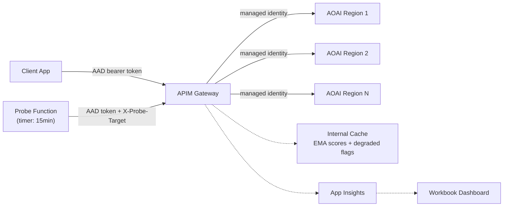

# azure-openai-latency-failover

[](https://github.com/function1st/azure-openai-latency-failover/actions/workflows/validate.yml)
[](LICENSE)

**Latency-aware routing for Azure OpenAI.** Azure OpenAI Global Standard deployments can silently degrade -- TTFT goes from 1-2s to 10s+ without returning errors. Standard circuit breakers (429/5xx) never trip. This project detects degradation inline at the request level and routes around it in seconds.

## What This Looks Like in Production

Azure OpenAI "soft throttling" produces no error codes — requests are accepted and queued internally. TTFT silently climbs from ~1s to 10s+. Standard circuit breakers never trip.

This is what routing looks like through this solution when East US 2 degrades:

> **Normal operation** — EMA-based routing distributes load across all three regions based on measured TTFT scores.

```
  request 1  ──► eastus2   1.2s ✓
  request 2  ──► westus3   1.4s ✓
  request 3  ──► uaenorth  1.8s ✓
  request 4  ──► eastus2   1.3s ✓
```

> **East US 2 silently degrades** — no errors, no 429s, TTFT climbs to 10s+. After 2 consecutive slow responses, the router marks it degraded and removes it from the pool immediately.

```
  request 5  ──► eastus2  11.4s ✗  badcount → 1
  request 6  ──► eastus2  12.1s ✗  badcount → 2  ► eastus2 REMOVED from pool
  request 7  ──► westus3   1.4s ✓  (eastus2 skipped)
  request 8  ──► uaenorth  1.7s ✓  (eastus2 skipped)
  request 9  ──► westus3   1.5s ✓  (eastus2 skipped)
```

> **Probe confirms recovery** — every 15 minutes the probe function sends synthetic requests to degraded backends. When TTFT returns to normal, the backend is automatically re-added to the pool.

```
  probe      ──► eastus2   1.1s ✓  ► eastus2 RESTORED to pool
  request 10 ──► eastus2   1.2s ✓  (back in rotation)
  request 11 ──► westus3   1.3s ✓
  request 12 ──► eastus2   1.1s ✓
```

> Only requests 5 and 6 were slow. Without this solution, every request would see 10-12s TTFT for the full duration of the event — which can last hours with no automatic recovery.

---

## How It Works

```
Client ──► APIM Gateway ──► Azure OpenAI (best healthy region)
               │
               ├─ Measures TTFT on every response (first streaming chunk)
               ├─ Maintains per-backend EMA score in internal cache
               ├─ Marks backend "degraded" after consecutive slow responses
               └─ Routes to lowest-score non-degraded backend

Probe Function (every 15 min) ──► APIM ──► each region
               │
               └─ Sends synthetic requests to degraded backends
                  to detect recovery and clear the degraded flag
```

**Detection**: Each response updates an Exponential Moving Average (EMA) of TTFT per backend. If TTFT exceeds the trip threshold for consecutive requests, the backend is marked degraded and removed from rotation.

**Recovery**: A timer-triggered Azure Function sends probe requests through APIM with a header bypass that targets specific backends. When a probe returns healthy TTFT, the degraded flag clears and the backend re-enters rotation.

**Authentication**: Zero API keys. All auth uses Azure AD JWT tokens and managed identity. APIM authenticates to Azure OpenAI via its system-assigned managed identity. Clients and the probe function authenticate to APIM via AAD tokens with app role claims.

## Architecture



## Prerequisites

- Azure subscription with permissions to create APIM, Function Apps, Managed Identities, and role assignments
- 2+ Azure OpenAI resources with the same model deployment name (different regions), all in the same resource group
- Azure CLI (`az`) v2.60+
- Node.js 20+
- [Azure Functions Core Tools](https://learn.microsoft.com/en-us/azure/azure-functions/functions-run-local) v4

## Quick Start

### 1. Set up AAD App Registration

Run the setup script first -- this only needs Azure CLI access to AAD, no infrastructure required:

```bash
CALLER_ID=$(az ad signed-in-user show --query id -o tsv)
./scripts/setup-aad.sh --caller-object-id $CALLER_ID
```

This creates an app registration with `LLM.Invoke` and `Probe.Execute` roles, grants `LLM.Invoke` to your user account so you can call the API, exposes a `user_impersonation` delegated scope, and outputs an **App Client ID**. Save it for the next step.

To grant API access to other users or service principals later, pass their object IDs with `--caller-object-id`, or use the Azure portal under **Microsoft Entra ID → Enterprise applications → aoai-latency-router → Users and groups**.

### 2. Configure Parameters

Copy and edit the parameter file:

```bash
cp infra/poc.bicepparam infra/local.bicepparam
```

Fill in your values. All AOAI resources must be in the same resource group as this deployment.

```bicep
using './main.bicep'

param backends = [
  {
    name: 'eastus2'
    endpoint: 'https://my-aoai-eus2.openai.azure.com'
    resourceId: '/subscriptions/<YOUR-SUBSCRIPTION-ID>/resourceGroups/<YOUR-RG>/providers/Microsoft.CognitiveServices/accounts/my-aoai-eus2'
  }
  {
    name: 'westus3'
    endpoint: 'https://my-aoai-wus3.openai.azure.com'
    resourceId: '/subscriptions/<YOUR-SUBSCRIPTION-ID>/resourceGroups/<YOUR-RG>/providers/Microsoft.CognitiveServices/accounts/my-aoai-wus3'
  }
]
param aadTenantId = '<YOUR-TENANT-ID>'
param aadAppClientId = '<APP-CLIENT-ID-FROM-STEP-1>'
param deploymentName = '<YOUR-AOAI-DEPLOYMENT-NAME>'
```

> **Note**: If your subscription lacks App Service quota in your main region (common on Visual Studio/MSDN subscriptions), add `param functionLocation = '<OTHER-REGION>'` to deploy the probe Function App to a different region. The Function App location is independent of APIM and AOAI.

### 3. Deploy Infrastructure

```bash
az bicep build-params -f infra/local.bicepparam --outfile infra/local.parameters.json

az deployment group create \
  -g <RESOURCE_GROUP> \
  -f infra/main.bicep \
  -p @infra/local.parameters.json \
  --name initial-deploy
```

APIM Developer tier takes ~30 minutes to provision on first deploy. Subsequent redeployments are fast (2-3 minutes).

> **Note**: If you tear down and redeploy, APIM uses soft-delete by default and the name is reserved for 48 hours. If you hit a `soft-deleted` error, purge it first:
> ```bash
> az apim deletedservice purge --service-name <namePrefix>-apim --location <region>
> ```

Note the `identityPrincipalId` output -- you need it for the next step:

```bash
az deployment group show -g <RESOURCE_GROUP> -n initial-deploy \
  --query "properties.outputs.identityPrincipalId.value" -o tsv
```

### 4. Grant Probe Role to Function Identity

```bash
./scripts/setup-aad.sh --function-mi-object-id <IDENTITY_PRINCIPAL_ID_FROM_STEP_3>
```

This grants the `Probe.Execute` role to the probe function's managed identity so it can authenticate to APIM.

### 5. Deploy Probe Function

```bash
cd src/probe-function
npm install
npm run build
func azure functionapp publish <FUNCTION_APP_NAME>
```

The function app name is in the `functionAppName` deployment output.

### 6. Smoke Test

Before running the smoke test, consent to the app registration (one-time, opens a browser):

```bash
az login \
  --tenant <YOUR-TENANT-ID> \
  --scope "api://<APP-CLIENT-ID>/user_impersonation"
```

Sign in and click **Accept**. Then validate everything is wired up correctly:

```bash
cd scripts && npm install
APIM_ENDPOINT=https://<your-apim>.azure-api.net \
AAD_APP_CLIENT_ID=<your-app-client-id> \
npx tsx demo.ts
```

A healthy deployment shows all configured backends receiving traffic with successful status codes and TTFT measurements. If you see 401s, check the consent step. If you see 502s, check the AOAI role assignments.

To grant API access to other users or service principals, use **Microsoft Entra ID → Enterprise applications → aoai-latency-router → Users and groups** and assign the `LLM.Invoke` role.

## Configuration Reference

All routing thresholds are stored as APIM Named Values and can be changed in the Azure portal without redeploying.

| Parameter | Named Value | Default | Description |
|---|---|---|---|
| Trip threshold | `ttft-trip-ms` | 8000 | TTFT (ms) above which a response counts as "bad" |
| Clear threshold | `ttft-clear-ms` | 3000 | TTFT (ms) below which a degraded backend is cleared |
| EMA alpha | `ema-alpha` | 0.3 | Smoothing factor. Higher = more reactive, lower = more stable |
| Consecutive bad | `consecutive-bad-threshold` | 2 | Bad responses in a row before marking degraded |
| Score cache TTL | (hardcoded) | 600s | How long EMA scores persist in cache |
| Degraded flag TTL | (hardcoded) | 900s | Auto-reset time if probes don't clear it |
| Probe interval | Function schedule | 15 min | How often the probe function runs |

**Tuning guide**: If your normal TTFT is ~1-2s and degraded is ~10s+, the defaults work well. If your baseline is different, adjust `ttft-trip-ms` to ~4x your normal p95 and `ttft-clear-ms` to ~1.5x your normal p95.

## Authentication Model

| Flow | Method | Details |
|---|---|---|
| Client → APIM | AAD JWT | Token scoped to `api://<appClientId>`, `LLM.Invoke` role required |
| Probe → APIM | AAD JWT | Same audience, `Probe.Execute` role required |
| APIM → Azure OpenAI | Managed Identity | System-assigned MI with `Cognitive Services OpenAI User` role |

The APIM policy accepts both v1.0 (`sts.windows.net`) and v2.0 (`login.microsoftonline.com`) token issuers, and both `<clientId>` and `api://<clientId>` as valid audiences. This ensures compatibility with Azure CLI, SDKs, and managed identities regardless of which token endpoint they use.

The AAD app registration defines two app roles:
- **`LLM.Invoke`** — Grant to service principals / managed identities of your client applications
- **`Probe.Execute`** — Granted automatically to the probe function's managed identity by `setup-aad.sh`

## Dashboard

The deployment includes an Azure Monitor Workbook with:
- **TTFT by Region** — p50/p95 time series per backend
- **Routing Distribution** — request volume per backend over time
- **Probe Results** — probe TTFT and success rate per region
- **Backend Health** — current status of each backend

Find it in the Azure portal under your resource group → Workbooks.

## Cost Estimate

| Resource | SKU | Monthly Cost |
|---|---|---|
| APIM | Developer | ~$50 |
| Function App | Basic B1 | ~$13 |
| App Insights | Pay-per-use | ~$0-5 |
| Storage Account | Standard LRS | ~$1 |
| **Total** | | **~$64-69/mo** |

The Function App can be changed to Consumption (Y1) by setting `param functionPlanSku = 'Y1'` if your subscription has Dynamic VM quota, bringing the total to ~$51-56/mo.

For production, upgrade APIM to StandardV2 (~$170/mo for BasicV2, ~$350/mo for StandardV2).

## Project Structure

```
infra/
  main.bicep              ← Orchestrator (accepts backends array)
  modules/
    apim.bicep            ← APIM + backends + generated policy + role assignments
    identity.bicep        ← User-assigned managed identity for probe
    function.bicep        ← Function App + Storage
    monitoring.bicep      ← App Insights + Log Analytics
  workbook.json           ← Dashboard template
  poc.bicepparam          ← Example parameter file
src/probe-function/       ← Timer-triggered probe (TypeScript, Azure Functions v4)
scripts/
  setup-aad.sh            ← AAD app registration setup
  demo.ts                 ← Test/validation script
```

The APIM policy XML is generated inside `apim.bicep` at deploy time from the `backends` array parameter. Users never edit XML directly.

## Upgrading to Production

- **APIM tier**: Switch to BasicV2 or StandardV2 for SLA and multi-unit scaling
- **VNet integration**: APIM StandardV2 supports VNet injection for private connectivity to AOAI
- **Multiple APIM regions**: For globally distributed clients, deploy APIM with multi-region gateways
- **Alerts**: Add Azure Monitor alerts on the probe failure rate and p95 TTFT metrics

## Teardown

To remove all deployed resources while preserving your Azure OpenAI resources:

```bash
./scripts/teardown.sh -g <RESOURCE_GROUP>
```

> **Note**: APIM uses soft-delete. The script purges the soft-deleted instance automatically so you can redeploy with the same name immediately.

## License

[MIT](LICENSE)
